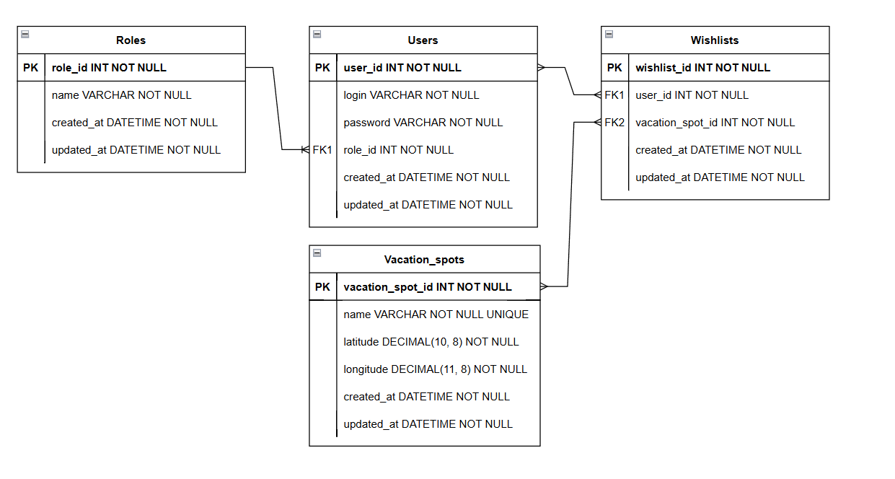

## Оглавление

-   [Сервис выбора мест отдыха](#сервис-выбора-мест-отдыха)
    -   [Функциональность](#функциональность)
        -   [Базовая версия](#базовая-версия)
        -   [Продвинутая версия](#продвинутая-версия)
    -   [Развёртывание проекта](#развёртывание-проекта)
        -   [Предварительные требования](#предварительные-требования)
        -   [Шаги для запуска](#шаги-для-запуска)
    -   [Документация API](#документация-api)
    -   [Postman коллекция](#postman-коллекция)
        -   [Авторизация:](#авторизация)
        -   [Работа с "wishlists":](#работа-с-wishlists)
    -   [Дополнительная информация](#дополнительная-информация)

# Сервис выбора мест отдыха

Этот проект представляет собой сервис для выбора мест отдыха, разработанный с использованием фреймворка Laravel и базы данных PostgreSQL. Приложение развёрнуто с использованием Docker Compose и предоставляет REST API для взаимодействия с системой.

## Функциональность

### Базовая версия

Базовая версия приложения доступна только администратору и включает следующие возможности:

-   **Управление местами отдыха**: получение списка мест отдыха, добавление новых мест. Каждое место содержит название, широту и долготу.
-   **Управление пользователями**: просмотр списка пользователей, добавление новых пользователей с уникальными логинами и хешированными паролями.
-   **Списки желаемого**: добавление мест отдыха в список желаемого для конкретного пользователя, просмотр списка желаемого по ID пользователя.

**Валидации:**

-   У одного пользователя не более 3 мест в списке желаемого.
-   Одно место не может быть добавлено дважды в список одного пользователя.
-   Название места отдыха уникально.
-   Логин пользователя уникален.

### Продвинутая версия

Продвинутая версия доступна всем пользователям и включает дополнительные возможности:

-   **Регистрация и авторизация**: регистрация с автоматическим назначением роли, вход с использованием JWT по логину и паролю.
-   **Роли и доступ**: администратор видит все записи и может добавлять новые места отдыха; обычный пользователь видит и управляет только своими записями.

## Развёртывание проекта

### Предварительные требования

-   Установленные Docker и Docker Compose.

### Шаги для запуска

1. **Клонирование репозитория:**

    ```bash
    git clone https://github.com/ваш-репозиторий.git
    cd ваш-репозиторий
    ```

2. **Запуск приложения:**

    ```bash
    docker-compose up --build
    ```

    Эта команда выполнит сборку и запуск контейнеров, а также выполнит скрипт `entrypoint.sh`, который находится в корне проекта.

3. **Скрипт `entrypoint.sh` выполняет следующие действия:**

-   Установка PHP-зависимостей с помощью Composer.
-   Запуск миграций базы данных.
-   Заполнение базы данных начальными данными (сидирование).
-   Запуск встроенного сервера Laravel.

    **Содержимое `entrypoint.sh`:**

    ```bash
        #!/bin/bash
        #Установка PHP-зависимостей с помощью Composer
        composer install --no-interaction --prefer-dist

        #Запуск миграций базы данных
        php artisan migrate:fresh --force

        #Заполнение базы данных начальными данными
        php artisan db:seed --force

        #Запуск встроенного сервера Laravel
        php artisan serve --host=0.0.0.0 --port=8000
    ```

4. **Доступ к приложению:**
   После успешного запуска приложение будет доступно по адресу: [http://localhost:8000/api](http://localhost:8000/api)[*`/users`*]

## Документация API

`Swagger`-документация доступна по адресу: http://localhost:8000/api/documentation

## Postman коллекция

В корне проекта находится файл `Test-Task.postman_collection.json`, содержащий коллекцию запросов для Postman. Коллекция включает три папки, каждая из которых содержит примеры запросов для различных сценариев.

### Авторизация:

-   #### Администратор:
    Сидеры добавляют администратора, 10 пользователей по умолчанию, пользователи имеют пароль "password"
    Админ
    ```json
    {
        "login": "admin",
        "password": "admin"
    }
    ```
    Пользователь
    ```json
    {
        "login": "{{$randomFullName}}",
        "password": "password"
    }
    ```
-   #### Регистрация нового пользователя:
    ```json
    {
        "login": "{{randomFullName}}",
        "password": "password",
        "password_confirmation": "password"
    }
    ```

### Работа с "wishlists":

-   `Администратор` может просматривать все списки желаемого, добавлять любое количество мест, включая повторяющиеся.
-   ` Обычные пользователи` могут добавлять не более 3 мест в список желаемого и не могут добавлять одно и то же место более одного раза. Они видят только свои списки желаемого.

## Дополнительная информация

-   `Seeders`: Все пользователи, созданные с помощью сидеров, имеют пароль: `password`.
-   `Контакт для связи`: https://t.me/matthew_matt
-   `ER-диаграмма базы данных`: Схема базы данных в нотации Мартина 
    `./ER_Diagram.png` в корне проекта.
